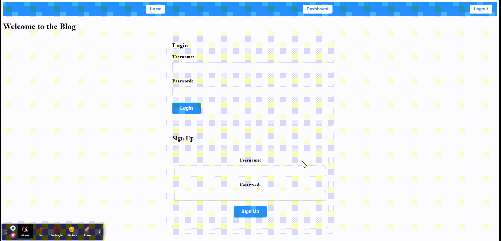
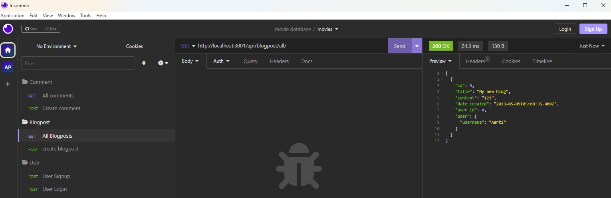
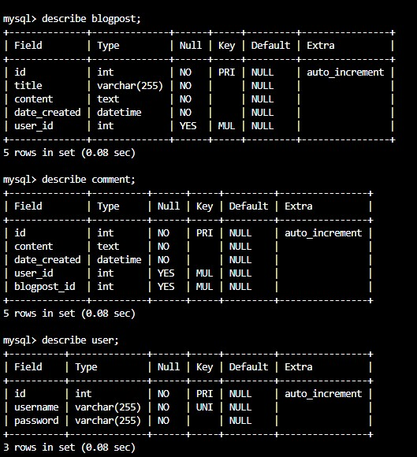

# mvc_tech-blog

## Description

[Visit the Site](https://mvc-tech-blog-aarti.herokuapp.com/)
<br>
Writing about tech can be just as important as making it. Developers spend plenty of time creating new applications and debugging existing codebases, but most developers also spend at least some of their time reading and writing about technical concepts, recent advancements, and new technologies. 

MVC Tech Blog is a CMS-style blog site similar to a Wordpress site, where developers can publish their blog posts and comment on other developers’ posts as well. It was built completely from scratch and is deployed on Heroku. This app follows the MVC paradigm in its architectural structure, using Handlebars.js as the templating language, Sequelize as the ORM, and the express-session npm package for authentication.

<br>
<br>


## Technology Used 

| Technology Used         | Resource URL           | 
| ------------- |:-------------:|    
| Git | [https://git-scm.com/](https://git-scm.com/)     |  
| JavaScript | [https://developer.mozilla.org/en-US/docs/Web/JavaScript](https://developer.mozilla.org/en-US/docs/Web/JavaScript) |  
| NodeJs | [https://nodejs.org/en](https://nodejs.org/en) |
| NPM | [https://www.npmjs.com/](https://www.npmjs.com/) |
| ExpressJS | [https://www.npmjs.com/package/express](https://www.npmjs.com/package/express) |
| Dotenv | [https://www.npmjs.com/package/dotenv](https://www.npmjs.com/package/dotenv) |
| MySQL2 | [https://dev.mysql.com/doc/](https://dev.mysql.com/doc/) |
| Insomnia | [https://insomnia.rest/](https://insomnia.rest/) |
| Sequelize | [https://www.npmjs.com/package/sequelize](https://www.npmjs.com/package/sequelize) |
| Bcrypt | [https://www.npmjs.com/package/bcrypt](https://www.npmjs.com/package/bcrypt) |
| Express-handlebars | [https://www.npmjs.com/package/express-handlebars](https://www.npmjs.com/package/express-handlebars) |
| Express-session | [https://www.npmjs.com/package/express-session](https://www.npmjs.com/package/express-session) |
| Connect-session-Sequelize | [https://www.npmjs.com/package/connect-session-sequelize](https://www.npmjs.com/package/connect-session-sequelize) |
| Heroku | [https://dashboard.heroku.com/apps/mvc-tech-blog-aarti](https://dashboard.heroku.com/apps/mvc-tech-blog-aarti) |


<br>
<br>


## Table of Contents

* [Installation](#installation)
* [Application Highlights and Usage](#application-highlights-and-usage)
* [Code Snippets](#code-snippets)
* [Learning Points](#learning-points)
* [Author Info](#author-info)
* [Credits](#credits)

<br>
<br>


## Installation

The MVC Tech Blog requires installation of mysql2, express, dotenv, sequelize, bcrypt, express-handlebars, connect-session-express NPM packages. After cloning down the repository, go to the command-line in the terminal and do an 'npm install' to install all the dependencies stated in the 'package.json' file and run 'node server.js' or 'npm start' to start the server.
<br>
<br>
<br>

## Application Highlights and Usage
<br>

1. The below GIF show how the user has to sign up first and then if user wants to visit the site they have to login by entering their username and password:

<br>
<br>



<br>
<br>
2. When a user clicks on the button to create a new blog post, the title and contents of the post are saved along with the date created:
<br>
<br>


<br>
<br>
3. The following image shows the APIs made and tested on Insomnia:
<br>
<br>



<br>
<br>


3. The following image shows the database structure and associations:
<br>
<br>


<br>
<br>


## Code Snippets

<br>

 The following code snippet shows an instance of setting up the sessions storage in server.js:

```javascript
//Import the session packages
const session = require('express-session');
const SequelizeStore = require('connect-session-sequelize')(session.Store);

// Set up the session store
const sessionStore = new SequelizeStore({
  db: sequelize,
});
// Configure the session middleware
app.use(
  session({
    secret: 'your-session-secret', 
    resave: false,
    saveUninitialized: false,
    store: sessionStore,
  })
);

```

<br>
<br>


## Learning Points 

   I learned the following skills while doing this project:
<br>
- Java script basics (variables,functions, arrays, for-loops, if-else etc)
- How to create a dynamic backend application using the command line
- Basics of NodeJs server and related functions
- How to write database mysql queries easily (SELECT, INSERT, UPDATE, JOIN, etc.) using sequelize npm package
- Using the express, sequelize and dotenv(to store private information) packages from NPM 
- Creating models and their association to create relationships between tables using sequelize.
- Using handlebars to create the HTML view of the application

<br>
<br>

## Author Info

### Aarti Contractor


- Portfolio: https://aarticontractor.github.io/aarticontractor_portfolio/
- Linkedin: https://www.linkedin.com/in/aarti-contractor/
- Github: https://github.com/aarticontractor

<br>

## Credits

- https://developer.mozilla.org/en-US/docs/Web/JavaScript
- https://cloudconvert.com/webm-to-gif
- https://nodejs.org/en
- https://www.npmjs.com/package/express
- https://developer.mozilla.org/en-US/docs/Glossary/SQL
- https://www.npmjs.com/package/dotenv
- https://dev.mysql.com/doc/
- https://www.npmjs.com/package/sequelize
- https://insomnia.rest/


<br>

© 2023 edX Boot Camps LLC. Confidential and Proprietary. All Rights Reserved.